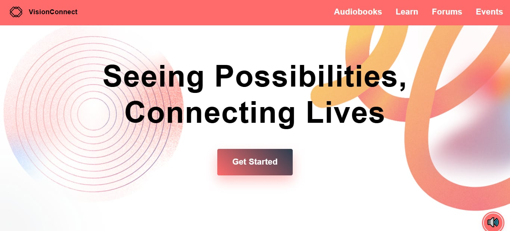
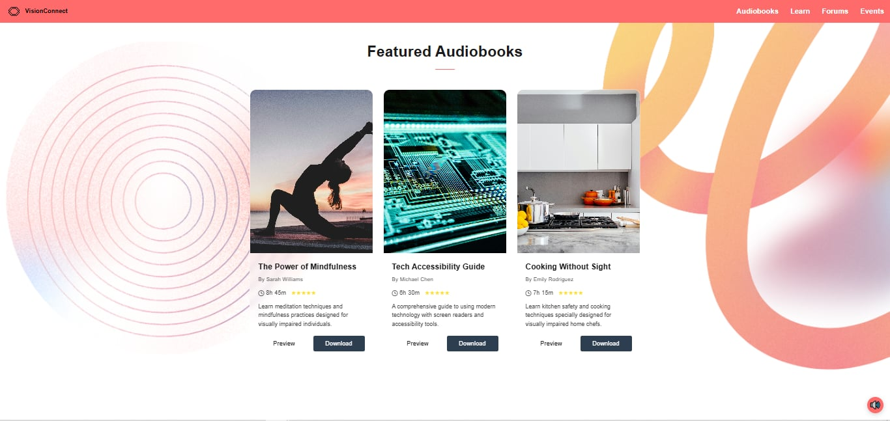
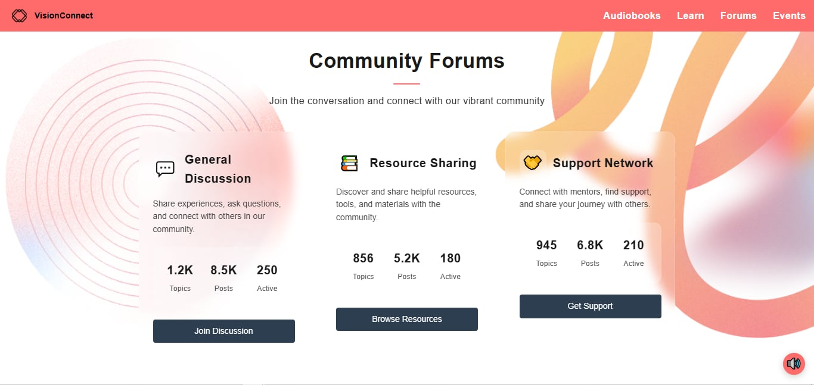
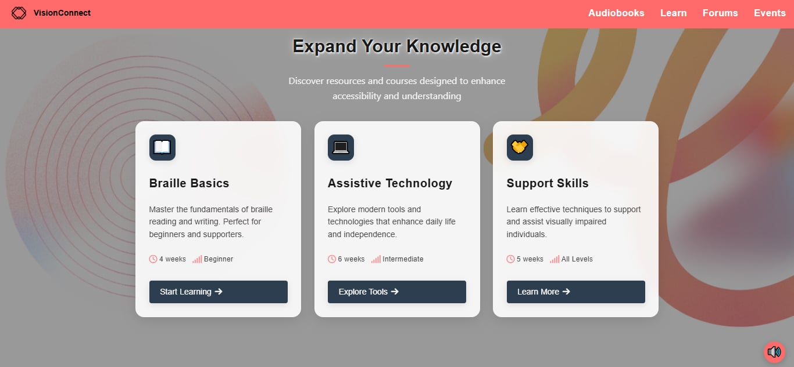
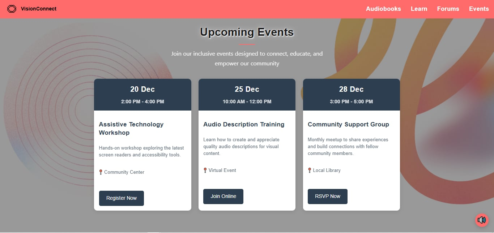

# 👁️ VisionConnect

### *"Seeing Possibilities, Connecting Lives"*

 

## 🌟 Introduction

**VisionConnect** is an accessibility-focused digital platform designed to enhance the online experience of visually impaired individuals. By providing an intuitive, inclusive, and user-friendly environment, the platform aims to bridge the digital divide and promote independence, learning, and community engagement.

VisionConnect serves not only individuals with visual impairments, but also educators, support organizations, accessibility advocates, and caregivers who share the goal of creating a more inclusive digital world.

---

## ✨ Core Features

### 📚 Audiobook Library
 

An extensive audiobook collection that offers an immersive and accessible reading experience.

**Features:**

* Thousands of audiobook titles across multiple genres
* Adjustable playback speed
* Multiple voice options
* Cross-device bookmarking and progress tracking
* Personalized playlists and categories

---

### 💬 Community Forum
 

A safe and supportive space where users can connect, share experiences, and learn from one another.

**Features:**

* Voice-based posting options
* Screen reader-friendly navigation
* Discussion boards and themed communities
* Direct messaging capabilities
* Topics ranging from daily living tips to assistive technology

---

### 🎓 Learning Resources
 

Educational materials specifically designed for visually impaired users.

**Resources include:**

* Assistive technology tutorials
* Life skills guides
* Career development resources
* Screen reader training modules
* Interactive and audio-supported lessons

---

### 📅 Events Calendar
 

Stay connected through workshops, community events, and support groups.

**Features:**

* Accessible event registration
* Automated reminders
* Detailed event descriptions
* Accessibility information for every event

---

## ♿ Accessibility Features

### 🧭 Navigation Tools

* Keyboard shortcuts
* Skip navigation links
* Logical heading structure
* Voice command support
* Consistent layouts for easier navigation

### 🎨 Visual Customization

* Adjustable text sizes
* Dark and light themes
* High-contrast color schemes
* Zoom support
* Customizable display preferences

### 🔊 Audio Support

* Text-to-speech functionality
* Adjustable reading speeds
* Audio descriptions for visual content
* Screen reader compatibility
* Customizable sound notifications

---

## 🛠 User Support

### Help Center

VisionConnect provides multiple support channels to ensure users receive assistance whenever needed:

* 24/7 live chat support
* Accessibility tutorials
* Frequently Asked Questions (FAQ)
* Technical assistance
* Community support forums

### Getting Started

New users are guided through:

1. Accessibility setup and preferences
2. Navigation techniques
3. Platform features and tools
4. Community engagement
5. Support resources

---

## 🔒 Privacy and Security

User privacy and security are at the core of VisionConnect.

* Secure data storage and transmission
* Regular security monitoring and updates
* Transparent privacy policies
* Confidential handling of personal information
* Optional anonymous participation in community features

---

## 🎯 Mission

VisionConnect is more than a platform—it's a community dedicated to improving accessibility, independence, and digital inclusion for visually impaired individuals.

By combining accessible technology with learning resources, social interaction, and personalized experiences, VisionConnect empowers users to explore, learn, and connect without barriers.

Together, we strive toward a future where everyone has equal access to digital opportunities.

## 🌍 VisionConnect

### *Seeing Possibilities, Connecting Lives.*
